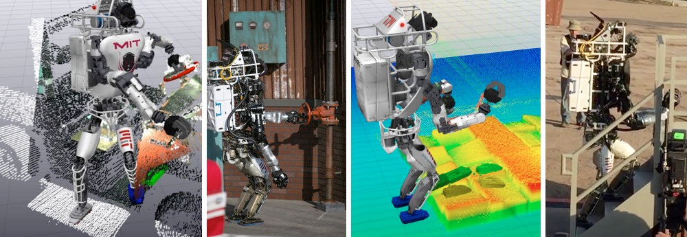
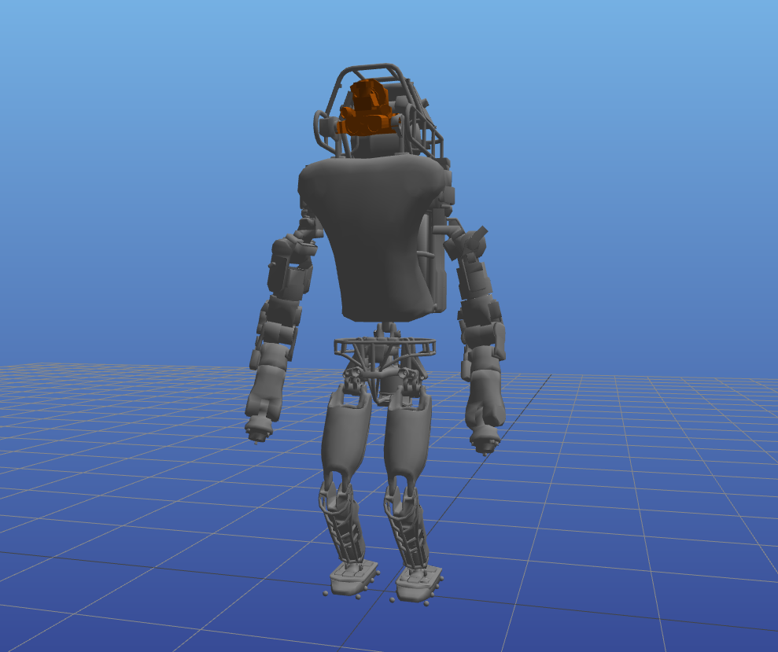

## Learning Contact-Aware Controllers from Partial Global Optimization

Robin Deits

MIT CSAIL: Robot Locomotion Group

Dynamic Walking 2018

---

### Motivation

* When our robots move, they do so with a fixed, pre-planned, time-coded contact sequence
* When the real world does not cooperate, we fall

---

### Motivation

* We want robots that can react to disturbances by deciding to make or break contact
* In particular, we will focus on simple center-of-mass models with (very) approximate kinematics:

<table>
    <tr>
        <th>Atlas Robot</th>
        <th>Model</th>
        <th>Simplified Humanoid</th>
    <tr>
        <td>
            
        </td>
        <td>
            
        </td>
        <td>
            
        </td>
    </tr>
</table>

---

### Approach: MPC

* We’ll describe our problem in the language of Model-Predictive Control:
    * Choose the robot’s state and action over the next N time steps...
        * ...to optimize some cost over state and action...
        * ...subject to the robot’s dynamics...
        * ...and respecting state and action constraints
    * Apply the optimal action for a single time step
    * Repeat the optimization

---

### Approach: Mixed-Integer MPC

* We will model our robot’s dynamics as (piecewise) linear and use a quadratic cost function
* This lets us write down the MPC optimization as a Mixed-Integer Quadratic Program (MIQP)
    * The branch-and-bound algorithm can solve MIQP optimizations to *global optimality*...
    * ...although this can potentially take an extremely long time
* Branch-and-bound iterates between finding better solutions and finding tighter bounds on the best solution, so we can also terminate it early and get a sub-optimal result.

---

### Dynamic Walking 2017: Learning Approximate Explicit MPC

* Last year's idea: learning an approximation of the optimal MPC policy by solving lots of mixed-integer programs offline and training a neural net
* This worked reasonably well for very simple systems:

<video data-autoplay src="img/cart-pole-net-half-speed.ogv" height="300" controls>

---

### Last Year (cont.)

* The idea of learning an explicit MPC policy fell apart for robots like our simplified humanoid.
    * Solving each individual optimization could take minutes or more, and we needed thousands of samples
    * We can partially solve each optimization (terminating before we have a proof of optimality), but then our network is learning from bad data.
* We need a better approach.

---

### This Year

* Observation 1: The branch-and-bound algorithm provides rigorous upper and lower bounds on the optimal objective *even if we stop early*.
* Observation 2: If we know the objective value of an MPC problem, then we know the *cost-to-go* from the robot's current state.
* Observation 3: If we have a model for the cost-to-go, then we can just greedily descend that cost function online and recover the optimal MPC behavior.

---

### Learning Value Functions from Bounded Optimization

* Offline:
    * Set up a large number of mixed-integer MPC optimizations, but terminate their solutions very early
    * Extract bounds on the optimal cost-to-go from each optimization
    * Train a neural net to approximate the cost-to-go given those bounds
* Online:
    * Use the learned cost-to-go to control the robot

---

### Learning Value Funtions

* Example: cost-to-go learned from the simplified humanoid robot model. Note how the learned cost-to-go deviates farther from LQR as the initial conditions become more extreme.

---

### Results

Initial velocity: $-2 \frac{m}{s}$

<table>
    <tr>
        <th>LQR</th>
        <th>Neural Net</th>
    </tr>
    <tr>
        <td>
<video data-autoplay src="img/trajectories/lqr-left-2mps-half-speed.m4v" height="300" controls>
        </td>
        <td>
<video data-autoplay src="img/trajectories/net-left-2mps-half-speed.m4v" height="300" controls>
        </td>
    </tr>
</table>

---

### Results

Initial velocity: $-1 \frac{m}{s}$

<table>
    <tr>
        <th>LQR</th>
        <th>Neural Net</th>
    </tr>
    <tr>
        <td>
<video data-autoplay src="img/trajectories/lqr-left-1mps-half-speed.m4v" height="300" controls>
        </td>
        <td>
<video data-autoplay src="img/trajectories/net-left-1mps-half-speed.m4v" height="300" controls>
        </td>
    </tr>
</table>

---

### Results

Initial velocity: $-0.5 \frac{m}{s}$

<table>
    <tr>
        <th>LQR</th>
        <th>Neural Net</th>
    </tr>
    <tr>
        <td>
<video data-autoplay src="img/trajectories/lqr-left-0.5mps-half-speed.m4v" height="300" controls>
        </td>
        <td>
<video data-autoplay src="img/trajectories/net-left-0.5mps-half-speed.m4v" height="300" controls>
        </td>
    </tr>
</table>

---

### Results

Initial velocity: $+1 \frac{m}{s}$

<table>
    <tr>
        <th>LQR</th>
        <th>Neural Net</th>
    </tr>
    <tr>
        <td>
<video data-autoplay src="img/trajectories/lqr-right-1mps-half-speed.m4v" height="300" controls>
        </td>
        <td>
<video data-autoplay src="img/trajectories/net-right-1mps-half-speed.m4v" height="300" controls>
        </td>
    </tr>
</table>

---

### Conclusions

* We can learn valuable information from incomplete solutions to hard mixed-integer optimizations
* We can use that information to make contact-aware controllers
* Still to come: applying the simplified cost-to-go to the full Atlas humanoid robot

Thanks to Twan Koolen, Tobia Marcucci, and Russ Tedrake for their expertise and assistance.

